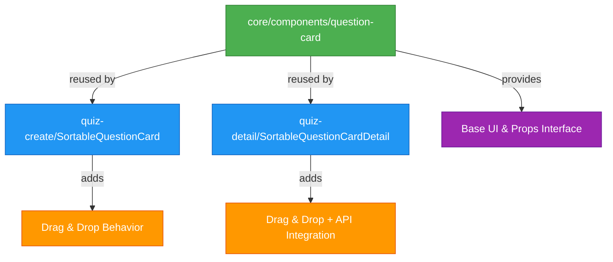

# Quiz Maker Application

A modern, full-featured quiz creation and management platform built with React and Next.js. This application allows users to create coding-related quizzes, take quizzes with real-time tracking, and view detailed result summaries with optional anti-cheat monitoring.

> Note: This project was built as a take-home technical assessment demonstrating modern React development practices, clean architecture, and comprehensive testing.

---

## Table of Contents

- [Features](#features)
- [Tech Stack](#tech-stack)
- [Project Structure](#project-structure)
- [Prerequisites](#prerequisites)
- [Installation & Setup](#installation--setup)
- [Running the Application](#running-the-application)
- [Available Scripts](#available-scripts)
- [Testing](#testing)
- [Code Quality](#code-quality)
- [Architecture Decisions](#architecture-decisions)
- [API Integration](#api-integration)
- [Key Libraries](#key-libraries)
- [Development Workflow](#development-workflow)
- [Known Limitations](#known-limitations)
- [Troubleshooting](#troubleshooting)
- [License](#license)

---

## Features

### Quiz Builder

- Create quizzes with title, description, and time limits
- Support for multiple question types:
  - Multiple Choice Questions (MCQ) with single correct answer
  - Short Answer questions with case-insensitive string matching
  - Code snippet display (optional for each question)
- Real-time validation and error handling
- Drag-and-drop question reordering with visual feedback
- Automatic position synchronization to backend

### Quiz Player

- Load quiz by ID with full question details
- Navigate between questions with Previous/Next controls
- Live countdown timer with auto-submit on timeout
- Answer persistence (saved to backend on each change)
- Submit quiz and view detailed results:
  - Overall score and percentage
  - Per-question correctness breakdown
  - Correct vs. submitted answers comparison

### Quiz Management

- Browse all available quizzes with pagination
- Search and filter functionality
- Edit existing quizzes with full detail view
- Drag-and-drop question reordering in edit mode
- Real-time position updates saved to backend
- Unified question card UI across all views

### Anti-Cheat System (Bonus)

- Focus/blur event tracking with timestamps
- Paste detection in answer inputs
- Event logging sent to backend
- Compact anti-cheat summary on results page
- Privacy-conscious implementation

---

## Tech Stack

| Category                 | Technology                               |
| ------------------------ | ---------------------------------------- |
| **Framework**            | Next.js 16.1.6 (App Router)              |
| **Language**             | TypeScript 5 (strict mode)               |
| **Styling**              | Tailwind CSS v4 + Radix UI               |
| **Server State**         | TanStack Query v5 (React Query)          |
| **Client State**         | Zustand with devtools middleware         |
| **Data Fetching**        | Axios with auto-generated client (Orval) |
| **Form Management**      | React Hook Form + Zod validation         |
| **UI Components**        | Radix UI primitives + custom components  |
| **Icons**                | Lucide React                             |
| **Internationalization** | next-intl                                |
| **Testing**              | Vitest + React Testing Library           |
| **Test Coverage**        | @vitest/coverage-v8                      |
| **Component Docs**       | Storybook v10.2.12                       |
| **Linting**              | ESLint v9 (flat config)                  |
| **Formatting**           | Prettier with Tailwind plugin            |
| **Git Hooks**            | Husky + lint-staged + Commitlint         |
| **Build Tool**           | Vite 7 with SWC                          |

---

## Project Structure

```
bookipi-fe-test/
├── app/                          # Next.js App Router pages
│   ├── [locale]/                 # Internationalized routes
│   │   ├── quiz-create/          # Quiz creation page
│   │   ├── quiz-list/            # Quiz listing page
│   │   └── quiz-player/[id]/     # Quiz taking page
│   └── layout.tsx
├── core/                         # Core utilities and shared code
│   ├── api/                      # Auto-generated API client (Orval)
│   ├── components/               # Reusable UI components
│   │   ├── button/
│   │   ├── dialog/
│   │   ├── form_field/
│   │   ├── input/
│   │   ├── loading_state/
│   │   ├── mcq-options/
│   │   └── ... (14 components total)
│   ├── lib/                      # Utility functions
│   ├── schemas/                  # Zod validation schemas
│   └── storybook/                # Storybook configuration
├── features/                     # Feature-based modules
│   ├── quiz-create/              # Quiz creation feature
│   │   ├── components/           # Feature-specific components
│   │   ├── react-query/          # API hooks & keys
│   │   ├── store/                # Zustand store
│   │   └── index.ts
│   ├── quiz-detail/              # Quiz detail/edit feature
│   ├── quiz-list/                # Quiz listing feature
│   └── quiz-player/              # Quiz player feature
│       ├── components/           # Timer, progress bar, answer inputs
│       ├── sections/             # Navigation, header, results
│       ├── container/            # Main player container
│       ├── react-query/          # Player API hooks
│       └── store/                # Player state management
├── messages/                     # i18n translation files
├── public/                       # Static assets
├── tests/                        # Test utilities and setup
└── ... (config files)
```

The project follows a feature-based structure where each feature is self-contained with its own components, state, and API hooks. Complex features use a container → sections → components hierarchy with clear separation between UI, state, and data fetching.

## Prerequisites

- Node.js: `>=22.0.0` (LTS recommended)
- npm: `>=10.0.0`
- Backend: Quiz Maker API running on `http://localhost:4000`

Check your versions:

```bash
node --version  # Should be v22.x or higher
npm --version   # Should be v10.x or higher
```

---

## Installation & Setup

### Backend Setup

1. Clone and setup the backend repository:

   ```bash
   cd /path/to/backend
   npm install
   ```

2. Configure backend environment variables:

   ```bash
   cp .env.example .env
   # Edit .env and set API_TOKEN (default: dev-token)
   ```

3. Initialize database with schema and seed data:

   ```bash
   npm run seed
   ```

4. Start the backend server:
   ```bash
   npm run dev
   ```
   Backend will run on `http://localhost:4000`

### Frontend Setup

1. Install dependencies:

   ```bash
   npm install
   ```

2. Configure environment variables:

   ```bash
   cp .env.example .env
   ```

   Edit `.env` and set:

   ```env
   NEXT_PUBLIC_API_URL=http://localhost:4000
   NEXT_PUBLIC_APP_ENV=development
   NEXT_PUBLIC_APP_URL=http://localhost:3000
   ```

3. Generate API client from backend:

   ```bash
   npm run api:generate
   ```

   This uses Orval to generate TypeScript types and React Query hooks from the backend API.

4. Initialize Git hooks (for development):
   ```bash
   npm run prepare
   ```

---

## Running the Application

### Development Mode

```bash
npm run dev
```

The application will be available at:

- Frontend: `http://localhost:3000`
- Storybook: Run `npm run storybook` for component documentation

### Production Build

```bash
# Build the application
npm run build

# Start production server
npm start
```

### Component Development (Storybook)

```bash
npm run storybook
```

Access Storybook at `http://localhost:6006` to browse all components with interactive examples.

---

## Available Scripts

| Script                    | Description                                            |
| ------------------------- | ------------------------------------------------------ |
| `npm run dev`             | Start Next.js development server                       |
| `npm run build`           | Generate API client → build for production             |
| `npm start`               | Start production server                                |
| `npm run lint`            | Run ESLint checks                                      |
| `npm run lint:fix`        | Fix auto-fixable ESLint issues                         |
| `npm run format`          | Format all files with Prettier                         |
| `npm run format:check`    | Check if files are formatted correctly                 |
| `npm run api:generate`    | Generate API client with Orval from OpenAPI spec       |
| `npm test`                | Run unit tests                                         |
| `npm run test:watch`      | Run tests in watch mode                                |
| `npm run test:coverage`   | Run tests with coverage report                         |
| `npm run test:ci`         | Run tests with coverage (CI mode)                      |
| `npm run storybook`       | Start Storybook on port 6006                           |
| `npm run build-storybook` | Build Storybook as static site                         |
| `npm run prepare`         | Setup Git hooks (automatically runs after npm install) |

---

## Testing

### Unit & Component Tests

The project uses Vitest with React Testing Library for comprehensive test coverage.

Run tests:

```bash
npm test              # Run all tests once
npm run test:watch    # Run tests in watch mode
npm run test:coverage # Generate coverage report
```

Test Coverage:

- 538 passing tests across 68 test files
- Features: quiz-create, quiz-detail, quiz-list, quiz-player
- Core components: All core components fully tested
- Stores: Zustand stores with 100% coverage
- Hooks: React Query hooks tested

Coverage breakdown:

- Components: ~100% (31 component tests)
- Hooks: ~100% (26 hook tests)
- Sections: ~100% (95 section tests)
- Stores: 100% (67 store tests)

### Test Structure

```
features/quiz-player/
├── components/
│   ├── countdown-timer/
│   │   ├── CountdownTimer.player.tsx
│   │   └── CountdownTimer.player.test.tsx  ✓
│   └── ...
├── sections/
│   ├── navigation/
│   │   ├── Navigation.player.tsx
│   │   └── Navigation.player.test.tsx      ✓
│   └── ...
└── store/
    ├── player.store.ts
    └── player.store.test.ts                ✓
```

---

## Code Quality

### ESLint Configuration

- Config: ESLint v9 flat config format
- Rules: Next.js recommended + TypeScript strict
- Custom rules:
  - No explicit `any` types
  - Unused vars with `_` prefix allowed
  - Import ordering enforced
  - React hooks rules enforced

### Prettier

- Config: `.prettierrc` with Tailwind plugin
- Features: Auto-sort Tailwind classes, consistent formatting

### Git Hooks (Husky)

Pre-commit hook:

- Runs `lint-staged` on staged files:
  - ESLint with auto-fix
  - Prettier formatting
- Blocks commit if errors can't be fixed

Commit-msg hook:

- Validates commit messages using Commitlint
- Required format: `type: description`
- Allowed types: feat, fix, docs, style, refactor, perf, test, chore, revert, ci, build
- Example: `feat: add quiz timer component`

Pre-push hook:

- Runs TypeScript type checking (`tsc --noEmit`)
- Runs full test suite with coverage
- Blocks push if type errors or test failures

### Commit Conventions

Follow [Conventional Commits](https://www.conventionalcommits.org/):

```bash
feat: add new feature
fix: fix bug
docs: update documentation
style: code style changes (formatting)
refactor: code refactoring
perf: performance improvements
test: add or update tests
chore: maintenance tasks
```

## Architecture Decisions

### Feature-Based Architecture

This project follows a feature-first approach inspired by Feature-Sliced Design (FSD):

```
features/[feature-name]/
├── container/       # Layout orchestrator (sections placement, no logic)
├── sections/        # Self-contained UI units with their own state
├── components/      # Feature-specific reusable components
├── react-query/     # API hooks with business logic (toast, cache)
├── store/           # Zustand store for cross-section state
└── utils/           # Feature-specific helper functions
```

Routes in `app/` contain minimal code and only import feature containers. Containers arrange sections without holding state. Sections are independent and manage their own state, API calls, and validation. Cross-section communication happens via Zustand stores to avoid prop drilling.

### State Management Strategy

| Type                    | Tool                  | Location                      |
| ----------------------- | --------------------- | ----------------------------- |
| Server state (API data) | TanStack Query v5     | `react-query/` per feature    |
| Quiz player state       | Zustand with devtools | `features/quiz-player/store/` |
| Quiz builder state      | Zustand with devtools | `features/quiz-create/store/` |
| Form state              | React Hook Form + Zod | Local to component            |
| Local UI state          | React `useState`      | Local to component            |

Zustand is used for player and builder state because the timer, current question index, and anti-cheat events need to be accessible from multiple sections. The store is reset on quiz start/end to prevent state leaks.

### API Integration Pattern

Backend connection:

```typescript
// core/lib/axios.ts
const api = axios.create({
  baseURL: env.NEXT_PUBLIC_API_URL,
  headers: { Authorization: `Bearer dev-token` },
});
```

Code generation with Orval:

```bash
npm run api:generate  # Reads openapi.json → generates hooks
```

Generated files:

- `core/api/quiz-maker.ts`: Type-safe API client
- `core/api/quiz-maker.zod.ts`: Zod schemas for all entities
- `core/api/quiz-maker.msw.ts`: MSW handlers for testing

Wrapper hooks provide an anti-corruption layer:

```typescript
// features/quiz-player/react-query/hooks/useSubmitAttempt.ts
export const useSubmitAttemptPlayer = () => {
  const mutation = useSubmitAttemptMutation();

  return useMutation({
    ...mutation,
    onSuccess: (data) => {
      toast.success('Quiz submitted successfully');
      queryClient.invalidateQueries({ queryKey: attemptsKeys.all });
    },
    onError: () => {
      toast.error('Failed to submit quiz');
    },
  });
};
```

This pattern keeps business logic (toasts, cache invalidation) in one place and prevents Orval regeneration from breaking features.

### Centralized Query Keys

All React Query keys are defined in `keys/` folders for type-safe references and consistent cache invalidation:

```typescript
// features/quiz-player/react-query/keys/attempts.keys.ts
export const attemptsKeys = {
  all: ['attempts'] as const,
  byQuiz: (quizId: string) => [...attemptsKeys.all, quizId] as const,
  byId: (id: string) => [...attemptsKeys.all, 'detail', id] as const,
};
```

### Component Reusability Pattern

This project implements a Core → Feature Wrapper pattern:



Core components (`core/components/question-card/QuestionCard.tsx`) are pure presentational components that accept all data via props with no API calls, translations, or store dependencies. This makes them easy to test in isolation.

Feature wrappers (`features/*/components/sortable-question-card/`) add feature-specific behavior like drag-and-drop using `@dnd-kit/sortable`, connect to Zustand stores, and handle API integration for position updates.

Code example:

```typescript
// Core component - pure UI
export function QuestionCard({ question, onEdit, onDelete, translations }: QuestionCardProps) {
  return (
    <div className="card">
      <h3>{question.prompt}</h3>
      {/* UI only, no business logic */}
    </div>
  );
}

// Feature wrapper - adds behavior
export function SortableQuestionCard({ questionId }: { questionId: string }) {
  const { attributes, listeners, setNodeRef } = useSortable({ id: questionId });
  const question = useQuizCreateStore((s) => s.questions.find(q => q.id === questionId));

  return (
    <div ref={setNodeRef} {...attributes} {...listeners}>
      <QuestionCard question={question} {...handlers} translations={t} />
    </div>
  );
}
```

Drag-and-drop uses `@dnd-kit/core` + `@dnd-kit/sortable` for keyboard accessibility. Position updates are sent to the backend via `PATCH /questions/:id/position` with optimistic UI updates and automatic rollback on error.

---

## API Integration

### Backend API Overview

The backend runs on `http://localhost:4000` and requires a Bearer token for authentication.

Authentication:

```bash
Authorization: Bearer dev-token
```

### Entities

#### Quiz

```typescript
{
  id: string;
  title: string;
  description: string;
  timeLimitSeconds?: number;
  isPublished: boolean;
  createdAt: string;
}
```

#### Question

```typescript
{
  id: string;
  quizId: string;
  type: 'mcq' | 'short' | 'code';
  prompt: string;
  codeSnippet?: string;
  options?: string[];      // For MCQ only
  correctAnswer?: string;  // For MCQ and short answer
  position: number;
}
```

#### Attempt

```typescript
{
  id: string;
  quizId: string;
  startedAt: string;
  submittedAt?: string;
  answers: Array<{
    questionId: string;
    value: string;
  }>;
  score?: number;
  antiCheatEvents?: Array<{
    type: 'focus' | 'blur' | 'paste';
    timestamp: string;
  }>;
}
```

### API Routes

#### Quizzes

- `GET /quizzes` - List all quizzes
- `GET /quizzes/:id` - Get quiz with questions
- `POST /quizzes` - Create quiz
- `PATCH /quizzes/:id` - Update quiz
- `DELETE /quizzes/:id` - Delete quiz

#### Questions

- `POST /quizzes/:quizId/questions` - Add question
- `PATCH /questions/:id` - Update question
- `DELETE /questions/:id` - Delete question
- `PATCH /questions/:id/position` - Reorder questions

#### Attempts

- `POST /attempts` - Start attempt (body: `{ quizId }`)
- `PATCH /attempts/:id/answers` - Save answer
- `POST /attempts/:id/submit` - Submit attempt for grading
- `GET /attempts/:id` - Get attempt with score and answers

### Auto-Grading

The backend automatically grades:

- MCQ: Exact string match with `correctAnswer`
- Short answer: Case-insensitive string match
- Code questions: Manual grading only (not auto-graded)

---

## Key Libraries

### Runtime Dependencies

| Library                       | Purpose                                 |
| ----------------------------- | --------------------------------------- |
| **next**                      | React framework with App Router and SSR |
| **react** / **react-dom**     | UI library                              |
| **@tanstack/react-query**     | Server state management with caching    |
| **zustand**                   | Lightweight client state management     |
| **axios**                     | HTTP client for API requests            |
| **zod**                       | Runtime schema validation               |
| **react-hook-form**           | Form state and validation               |
| **@radix-ui/\***              | Headless accessible UI primitives       |
| **lucide-react**              | Icon library                            |
| **next-intl**                 | Internationalization (i18n)             |
| **react-spinners**            | Loading spinners (MoonLoader)           |
| **tailwindcss**               | Utility-first CSS framework             |
| **class-variance-authority**  | Type-safe variant API for components    |
| **clsx** / **tailwind-merge** | Conditional className utilities         |

### Development Dependencies

| Library                    | Purpose                                 |
| -------------------------- | --------------------------------------- |
| **typescript**             | Static type checking                    |
| **vitest**                 | Fast unit test runner                   |
| **@testing-library/react** | React component testing utilities       |
| **@vitest/coverage-v8**    | Code coverage reporting                 |
| **@playwright/test**       | E2E testing framework                   |
| **storybook**              | Component documentation and development |
| **eslint**                 | Static code analysis and linting        |
| **prettier**               | Code formatting                         |
| **husky**                  | Git hooks automation                    |
| **lint-staged**            | Run linters on staged files             |
| **@commitlint/cli**        | Enforce conventional commit messages    |
| **orval**                  | OpenAPI to TypeScript code generator    |

---

## Development Workflow

### Git Workflow

**1. Create feature branch:**

```bash
git checkout -b feat/add-quiz-timer
```

**2. Make changes and commit:**

```bash
git add .
git commit -m "feat: add countdown timer to quiz player"
```

**3. Push to remote:**

```bash
git push origin feat/add-quiz-timer
```

The git hooks will automatically:

- Lint and format code (pre-commit)
- Validate commit message format (commit-msg)
- Run TypeScript checks and tests (pre-push)

### Adding a New Feature

1. Create feature folder:

```bash
mkdir -p features/my-feature/{container,sections,components,react-query,store}
```

2. Create container:

```typescript
// features/my-feature/container/MyFeature.container.tsx
export const MyFeatureContainer = () => {
  return (
    <div>
      <HeaderSection />
      <ContentSection />
    </div>
  );
};
```

3. Create sections with tests:

```typescript
// features/my-feature/sections/header/Header.section.tsx
// features/my-feature/sections/header/Header.section.test.tsx
```

4. Add Storybook stories:

```typescript
// features/my-feature/sections/header/Header.section.stories.tsx
```

5. Create API hooks if needed:

```typescript
// features/my-feature/react-query/hooks/useMyData.ts
// features/my-feature/react-query/keys/my-data.keys.ts
```

### Regenerating API Client

When the backend API changes:

```bash
# 1. Update core/openapi/openapi.json with new spec
# 2. Regenerate client
npm run api:generate
# 3. Update wrapper hooks if needed
# 4. Run tests to catch breaking changes
npm test
```

---

## Known Limitations

### Scope Constraints

- No authentication: Assumes direct API access with Bearer token
- Single user mode: No user sessions or multi-user quiz attempts
- Code question grading: Code questions are stored but not auto-graded
- Limited anti-cheat: Only focus/blur/paste events tracked, no advanced detection

### Technical Limitations

- Client-side timer: Timer runs in browser, can be manipulated (use backend timer for production)
- No offline support: Requires active internet connection
- No real-time updates: Quiz changes don't sync live to active attempts
- No retry logic: Failed API calls require manual retry
- Drag-and-drop limitations:
  - Requires JavaScript enabled
  - Not optimized for touch devices (works but not ideal UX)
  - No undo/redo for position changes
  - Network latency may cause brief UI delays on position updates

### Future Improvements

- Add authentication with user sessions
- Implement server-side timer verification
- Add code question auto-grading with test cases
- Add rich text editor for questions
- Add image/media upload support
- Add quiz analytics dashboard
- Add attempt history and review mode
- Add collaborative quiz editing
- Add quiz templates and duplication
- Add export/import quiz functionality

---

## Troubleshooting

### Common Issues

Error: "Cannot find module 'core/api/quiz-maker'"

Solution: Generate the API client:

```bash
npm run api:generate
```

---

Backend connection refused

Solution: Ensure backend is running:

```bash
cd backend-folder
npm run dev  # Should run on port 4000
```

Check `NEXT_PUBLIC_API_URL` in `.env` matches backend URL.

---

Tests failing with "Cannot find module"

Solution: Clear Vitest cache:

```bash
npx vitest --clearCache
npm test
```

---

Git hooks not running

Solution: Initialize Husky:

```bash
npm run prepare
```

Verify hooks:

```bash
ls -la .husky/_/
```

---

TypeScript errors after API regeneration

Solution: Restart TypeScript server in VS Code:

1. Open Command Palette (`Cmd+Shift+P`)
2. Run "TypeScript: Restart TS Server"

---

Port 3000 already in use

Solution: Kill existing process:

```bash
lsof -ti:3000 | xargs kill -9
```

Or use different port:

```bash
PORT=3001 npm run dev
```

---

Storybook not showing components

Solution: Rebuild Storybook cache:

```bash
rm -rf node_modules/.cache/storybook
npm run storybook
```

---

### Getting Help

If you encounter issues not covered here:

1. Check Node.js version: `node --version` (should be >=22.0.0)
2. Clear all caches: `rm -rf .next node_modules/.cache`
3. Reinstall dependencies: `rm -rf node_modules && npm install`
4. Check backend API is accessible: `curl http://localhost:4000/quizzes`

---

## License

MIT License - see LICENSE file for details.

## Contact / Author

Project: Quiz Maker Application (Take-Home Assessment)  
Year: 2024  
Framework: Next.js 16 + React 19 + TypeScript 5

For questions about this implementation, please refer to the codebase documentation and test files which provide extensive examples of usage patterns.
